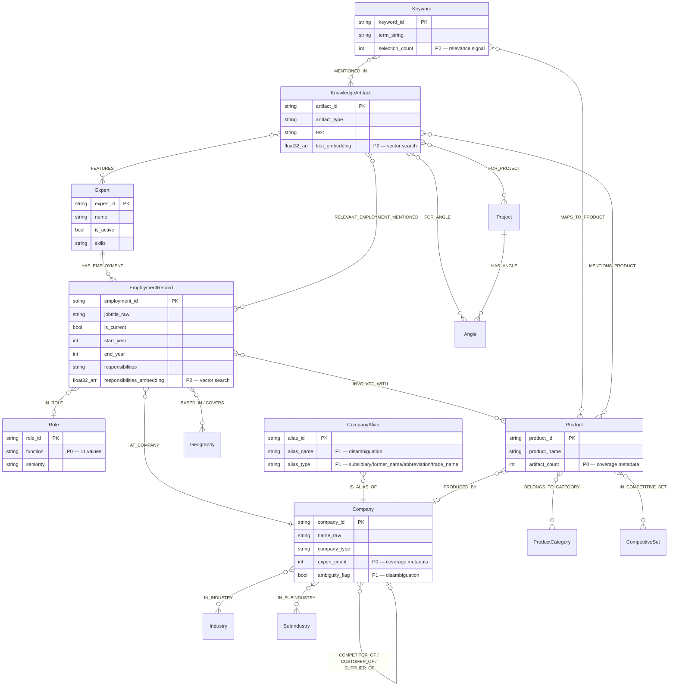

# Knowledge Graph Schema Upgrades

This document covers all schema changes applied to the Spanner Knowledge Graph to support the RAG Search Agent. Changes are organized by priority tier (P0 → P1 → P2), each building on the previous. The final state is the `kg_products_v5_dev` database.

## Overview

```
Baseline (kg_products_v4, source project)
  ├── P0  Data Cleanup + Coverage Metadata
  ├── P1  Entity Disambiguation + Routing Signals
  ├── P2  Keyword Edges + Confidence + Embeddings
  └── v5  Full schema rebuild from re-exported JSON (kg_products_v5_dev)
          + all P0/P1/P2 additions reapplied
```

### Summary of Changes

| Area | What changed | Why |
|------|-------------|-----|
| Data cleanup | Normalized `supply_chain_position` (10 values), `role.function` (11 values) | Dirty enum values (23 and 15 variants respectively) broke graph filters |
| Coverage metadata | `company.expert_count`, `product.artifact_count` | Sparse-result explainer needs pool size to report "Found X of ~Y" |
| Disambiguation | `company_alias` table, `company.ambiguity_flag` | "Shell" matches 3 companies — agent must surface the ambiguity |
| Routing signals | `expected_resolution`, `function_confidence` | Router needs to know if a keyword resolves to a product vs. industry |
| Keyword edges | `edge_maps_to_function` (D3), `edge_maps_to_product_category` (D4) | Keyword expansion path: keyword → function/category → experts |
| Embeddings | `text_embedding`, `responsibilities_embedding` (ARRAY\<FLOAT32\>) | Vector search over 2 corpora with COSINE_DISTANCE |
| LLM views | 5 pre-joined views | Simplify LLM-generated SQL by hiding multi-hop joins |

---

## P0 — Data Cleanup + Coverage Metadata

**Migration scripts:** `05_schema_changes.py` (steps 2.1–2.4), `05b_schema_fixes.py` (fixes 1–2)

### 2.1 Normalize `supply_chain_position`

**Table:** `edge_involved_with`

The `supply_chain_position` column had 23 inconsistent variants (mixed case, compound values, empty strings). Cleaned down to 10 canonical lowercase values.

**Cleanup rules:**
- Lowercase + trim all values
- `buyer/user`, `former buyer`, `previous customer` → `buyer`
- `user/evaluator` → `user`
- Empty string → `none`

**Final 10 values:**

| Value | Description |
|-------|-------------|
| `buyer` | Procurement decision-maker or purchaser |
| `seller` | Vendor-side representative |
| `user` | End-user of the product |
| `evaluator` | Assessed the product (RFP, POC, etc.) |
| `advisor` | Consulted on the product/vendor selection |
| `analyst` | Covered the product/market as an industry analyst |
| `operator` | Ran/operated the product day-to-day |
| `competitor` | Worked at a competing vendor |
| `neutral` | Involved but no directional position |
| `none` | No supply chain position recorded |

### 2.2 Consolidate `role.function` — 15 → 11 values

**Table:** `role`

Two rounds of cleanup. First, `Human Resources` → `HR`. Then five more merges to reach the target 11-value taxonomy.

**Merge mapping:**

| Old value (dropped) | Merged into | Rationale |
|---------------------|-------------|-----------|
| Human Resources | HR | Rename |
| Advisory (572 rows) | Strategy | Advisory roles are strategic |
| Trading (59 rows) | Commercial | Trading is commercial activity |
| Board (2 rows) | C-Suite | Board-level = C-Suite |
| Marketing (7 rows) | Commercial | Marketing is commercial |
| Legal-Regulatory (177 rows) | Legal | Cleaner label |

**Final 11 values:** Operations, Commercial, Finance, Strategy, Engineering, IT, R&D, Procurement, HR, C-Suite, Legal

### 2.3 Add `expert_count` to `company`

```sql
ALTER TABLE company ADD COLUMN expert_count INT64
```

Populated via:

```sql
UPDATE company c SET c.expert_count = (
    SELECT COUNT(DISTINCT er.expert_id)
    FROM edge_at_company eac
    JOIN employment_record er ON eac.employment_id = er.employment_id
    WHERE eac.company_id = c.company_id
) WHERE TRUE
```

**Used by:** `get_coverage_diagnostics()` — reports "Company X has Y linked experts" when results are sparse.

### 2.4 Add `artifact_count` to `product`

```sql
ALTER TABLE product ADD COLUMN artifact_count INT64
```

Populated by counting `edge_involved_with` rows per product.

**Used by:** Coverage estimation — "Found X of ~Y estimated artifacts for this product."

### Standardize `company.company_type`

```sql
UPDATE company SET company_type = 'Unknown'
WHERE company_type IS NULL OR company_type = ''
```

---

## P1 — Entity Disambiguation + Routing Signals

**Migration scripts:** `05_schema_changes.py` (steps 2.5–2.9), `05b_schema_fixes.py` (fix 3), `08_populate_ambiguity_flags.py`, `09_seed_company_aliases.py`

### 2.5 Add `ambiguity_flag` to `company`

```sql
ALTER TABLE company ADD COLUMN ambiguity_flag BOOL DEFAULT (false)
```

**Population logic** (script `08_populate_ambiguity_flags.py`):
1. Reset all flags to `false`
2. Find groups of `company_id`s sharing the same `LOWER(name_raw)`
3. Set `ambiguity_flag = true` for all companies in groups with 2+ members

**Used by:** `check_company_disambiguation()` — when a user searches for "Shell" and it matches 3 different company entities.

### 2.6 Create `company_alias` table

New node table for known aliases, subsidiaries, former names, and abbreviations.

```sql
CREATE TABLE company_alias (
    alias_id   STRING(256) NOT NULL,
    company_id STRING(256) NOT NULL,
    alias_name STRING(512) NOT NULL,
    alias_type STRING(32),       -- subsidiary | former_name | abbreviation | trade_name
) PRIMARY KEY(alias_id)

CREATE INDEX idx_alias_name ON company_alias(alias_name)
CREATE INDEX idx_alias_company ON company_alias(company_id)
```

**Companion edge table** (required because Spanner Property Graph doesn't allow a table to appear as both node and edge):

```sql
CREATE TABLE edge_is_alias_of (
    alias_id   STRING(256) NOT NULL,
    company_id STRING(256) NOT NULL,
) PRIMARY KEY(alias_id, company_id)
```

**Seeded data** (script `09_seed_company_aliases.py`) — 20 major companies with known aliases:

| Company | Example aliases |
|---------|----------------|
| Shell | Royal Dutch Shell (former_name), Shell plc (trade_name), Shell Energy (subsidiary) |
| Amazon | Amazon.com (trade_name), AWS (abbreviation), Amazon Web Services (subsidiary) |
| Google | Alphabet (trade_name), Google Cloud (subsidiary), Google LLC (trade_name) |
| Microsoft | Microsoft Corporation (trade_name), Microsoft Azure (subsidiary), MSFT (abbreviation) |
| Meta | Facebook (former_name), Meta Platforms (trade_name) |
| GE | General Electric (trade_name), GE Healthcare (subsidiary), GE Aerospace (subsidiary) |
| HP | Hewlett-Packard (former_name), HP Inc. (trade_name), HPE (abbreviation) |
| ... | + Oracle, Apple, IBM, SAP, Accenture, Deloitte, McKinsey, PwC, EY, KPMG, Siemens, Salesforce, Cisco |

### 2.8 Add `expected_resolution` to keyword edges

```sql
ALTER TABLE edge_maps_to_product ADD COLUMN expected_resolution STRING(16)
ALTER TABLE edge_maps_to_industry ADD COLUMN expected_resolution STRING(16)
```

Routing signal — tells the Router whether a keyword is expected to resolve to a product or an industry, improving strategy selection.

### 2.9 Add `function_confidence` to `edge_has_role`

```sql
ALTER TABLE edge_has_role ADD COLUMN function_confidence FLOAT64
```

Confidence score for the role function classification. Lower confidence roles can be deprioritized in search results.

### 2.7 Update Property Graph

Full `CREATE OR REPLACE PROPERTY GRAPH kg_graph` to include:
- `company`: new properties `expert_count`, `ambiguity_flag`
- `product`: new property `artifact_count`
- `edge_maps_to_product` / `edge_maps_to_industry`: new property `expected_resolution`
- `edge_has_role`: new property `function_confidence`
- New node `CompanyAlias` + edge `IS_ALIAS_OF`

---

## P2 — Keyword Edges + Confidence + Embeddings

**Migration scripts:** `05_schema_changes.py` (steps 2.10–2.13), `05b_schema_fixes.py` (fixes 3–4), `07_generate_embeddings.py`, `10_classify_keywords.py`

### 2.10 Create `edge_maps_to_function` (D3)

New keyword → role function edge table for keyword expansion.

```sql
CREATE TABLE edge_maps_to_function (
    keyword_id    STRING(256) NOT NULL,
    role_function STRING(64)  NOT NULL,
    confidence    FLOAT64,
) PRIMARY KEY(keyword_id, role_function)
```

**Population:** `10_classify_keywords.py` sends keywords to Gemini in batches for classification against the 11 known role functions. Only mappings with confidence >= 0.5 are inserted.

**Used by:** `expand_keyword_to_experts()` — resolves keywords to role functions, then finds experts in those functions.

### 2.11 Create `edge_maps_to_product_category` (D4)

New keyword → product category edge table.

```sql
CREATE TABLE edge_maps_to_product_category (
    keyword_id          STRING(256) NOT NULL,
    product_category_id STRING(256) NOT NULL,
    confidence          FLOAT64,
) PRIMARY KEY(keyword_id, product_category_id)
```

**Population:** Same `10_classify_keywords.py` script classifies keywords against 31 known product categories.

### 2.12 Add `selection_count` to `keyword`

```sql
ALTER TABLE keyword ADD COLUMN selection_count INT64 DEFAULT (0)
```

Populated by counting how many times each keyword's associated experts were selected for projects (via `edge_mentioned_in` → `knowledge_artifact` → `edge_selected_for` join chain). Higher selection count = keyword is a stronger predictor of expert relevance.

### 2.13 Add embedding columns

```sql
ALTER TABLE knowledge_artifact ADD COLUMN text_embedding ARRAY<FLOAT32>(vector_length=>768)
ALTER TABLE employment_record ADD COLUMN responsibilities_embedding ARRAY<FLOAT32>(vector_length=>768)
```

**Population** (script `07_generate_embeddings.py`):
- Model: Vertex AI `text-embedding-005` (768 dimensions)
- Task type: `RETRIEVAL_DOCUMENT`
- `knowledge_artifact.text` → `text_embedding` (473 rows; transcripts, bios, Q&A)
- `employment_record.responsibilities` → `responsibilities_embedding` (5,569 rows; job responsibilities)
- Idempotent: only rows with NULL embedding are processed
- Batching: 1 row/call for artifacts (long text up to 60k chars), 8 rows/call for responsibilities (short text, 8k char cap)
- Retry with exponential backoff on transient errors

**Used by:** `search_experts_by_vector()` — embeds query with `RETRIEVAL_QUERY` task type, then ranks by `COSINE_DISTANCE` via `UNION ALL` over both corpora.

### LLM Views (5 pre-joined views)

Created by `05b_schema_fixes.py` (fix 4). Simplify multi-hop queries into single-table scans for LLM-generated SQL.

| View | Joins flattened | Use case |
|------|----------------|----------|
| `DecisionMakers_View` | Expert → Employment → Company → Product (where `is_key_decision_maker = true`) | "Who are the key decision makers for Salesforce?" |
| `Buyers_View` | Expert → Employment → Company → Product (where `supply_chain_position = 'buyer'`) | "Who are the buyers of SAP ERP?" |
| `CurrentExperts_View` | Expert → Employment → Company → Role (where `is_current = true` AND `is_active = true`) | "Current experts at Shell" |
| `ExpertProducts_View` | Expert → Employment → Company → Product (all involvement) | "What products has this expert worked with?" |
| `CompanyCompetitors_View` | Company → edge_competitor_of → Company | "Who are Oracle's competitors?" |

---

## v5 — Full Schema Rebuild

**Migration scripts:** `11_create_v5_db.py`, `12_load_v5_data.py`, `13_apply_v5_graph.py`, `14_prepare_v5_schema.py`

The v5 database was rebuilt from re-exported JSON data with several structural improvements over v4.

### Column renames (v4 → v5)

| Table | Old column | New column |
|-------|-----------|------------|
| `expert` | `expert_name` | `name` |
| `company` | `company_name` | `name_raw` |
| `keyword` | `keyword` | `term_string` |
| `edge_customer_of` | `from_company_id` | `buyer_company_id` |
| `edge_customer_of` | `to_company_id` | `seller_company_id` |
| `edge_supplier_of` | `from_company_id` | `supplier_company_id` |
| `edge_supplier_of` | `to_company_id` | `buyer_company_id` |
| `edge_has_role` | (table renamed) | `edge_in_role` |

### New tables in v5

| Table | Description |
|-------|-------------|
| `edge_keyword_inference` | Polymorphic keyword → entity edge (target can be Expert, Product, Industry, etc.). Excluded from Property Graph — queryable via SQL only. |
| `edge_mentions_product` | KnowledgeArtifact → Product (direct mention edge) |
| `edge_relevant_employment_mentioned` | KnowledgeArtifact → EmploymentRecord with `matched_employer_text` context |
| `edge_angle_maps_to_keyword` | Angle → Keyword mapping |
| `edge_angle_targets_geo` | Angle → Geography targeting |
| `edge_angle_targets_role` | Angle → Role targeting |

### Schema additions reapplied to v5

Script `14_prepare_v5_schema.py` reapplies all P0/P1/P2 additions to the v5 schema:
- Embedding columns with `vector_length=>768` annotation
- `company.expert_count` + `company.ambiguity_flag`
- `company_alias` + `edge_is_alias_of`
- `edge_maps_to_function`, `edge_maps_to_industry`, `edge_maps_to_product_category`
- Updated Property Graph including all new nodes, edges, and columns

---

## Migration Script Index

All scripts are idempotent and located in `scripts/migrations/`.

| Script | Phase | Description |
|--------|-------|-------------|
| `01_create_instance_and_db.py` | Setup | Create Spanner instance + v4 database (tables only, no graph) |
| `02_copy_data.py` | Setup | Copy all data from source project to dev (36 tables) |
| `03_apply_property_graph.py` | Setup | Apply initial Property Graph (`kg_graph`) to v4 |
| `04_verify.py` | Setup | Verify data copy — row count comparison |
| `05_schema_changes.py` | P0/P1/P2 | All ALTER TABLE + CREATE TABLE changes (2.1–2.13) |
| `05b_schema_fixes.py` | P0/P1/P2 | Role taxonomy 15→11, company_type, Property Graph update, LLM views |
| `06_copy_kg_v2_3.py` | Setup | Copy ops database (kg_v2_3) to dev environment (~2.4M rows) |
| `07_generate_embeddings.py` | P2 | Populate text_embedding + responsibilities_embedding via Vertex AI |
| `08_populate_ambiguity_flags.py` | P1 | Set ambiguity_flag based on name collision heuristic |
| `09_seed_company_aliases.py` | P1 | Insert known aliases for 20 major companies |
| `10_classify_keywords.py` | P2 | LLM classification: keywords → functions + product categories |
| `11_create_v5_db.py` | v5 | Create kg_products_v5_dev from JSON-derived DDL |
| `12_load_v5_data.py` | v5 | Load all data-v5/ JSON into v5 database |
| `13_apply_v5_graph.py` | v5 | Apply Property Graph to v5 |
| `14_prepare_v5_schema.py` | v5 | Reapply P0/P1/P2 additions + embeddings to v5 |

---

## Final Schema Diagram

The current v5 Property Graph (`kg_graph`) with all upgrades applied:


