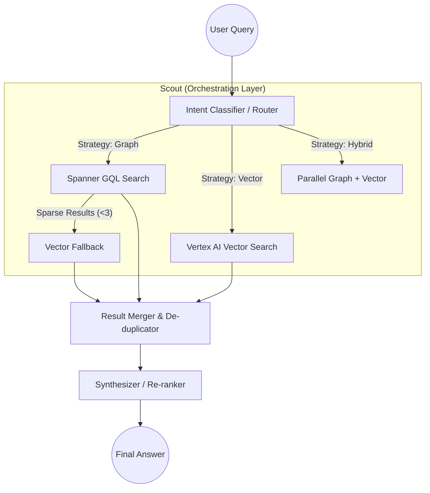

# Vertex RAG Search Agent

The **Vertex RAG Search Agent** is a sophisticated expert discovery pipeline designed to traverse complex professional networks. It uses a hybrid retrieval strategy combining **Spanner Property Graph (GQL)** for structural queries and **Vertex AI Vector Search** for semantic discovery.

## Architecture Overview

The agent follows a modular "Router-Scout-Synthesizer" pattern, where intent classification happens before any data retrieval.

## Key Components

### 1. Intent-Based Router (`agents/router.py`)
A Gemini-powered classifier that analyzes the query to determine the optimal retrieval path.
- **Graph Path**: Chosen for queries with specific entities (companies, products) or structural constraints (seniority, supply chain roles).
- **Vector Path**: Chosen for semantic or behavioral language ("experienced in navigating transitions").
- **Hybrid Path**: Chosen when a query combines both structural anchors and semantic qualifiers.
- **Parameter Extraction**: Automatically extracts structured filters (Product, Company, Industry, Function, Seniority, Supply Chain Position) for GQL traversal.

### 2. Conditional Scout (`agents/scout.py`)
The execution engine that implements the retrieval logic:
- **Hybrid Execution**: Runs Graph and Vector searches in parallel for "hybrid" intents.
- **Automatic Fallback**: If a "Graph" search returns fewer than 3 results, the Scout automatically triggers a Vector search to ensure coverage.
- **Multi-hop Traversal**: Dispatches to specialized tools capable of traversing 3-4 hops across the knowledge graph (Expert → Employment → Company → Industry).

### 3. Synthesizer (`agents/synthesizer.py`)
The final stage that transforms raw data into a professional response:
- **De-duplication**: Groups multiple employment records by expert.
- **Re-ranking**: Prioritizes current roles, direct involvement, and higher seniority.
- **Evidence-based Synthesis**: Provides specific reasons why each expert matches the query based on the retrieved graph/vector metadata.

## Retrieval Strategies

### Structural Search (Graph)
Leverages **Spanner Property Graph** to perform precise traversals. Supported paths include:
- `Expert → EmploymentRecord → [INVOLVED_WITH] → Product`
- `Expert → EmploymentRecord → [AT_COMPANY] → Company → [IN_INDUSTRY] → Industry`
- `Keyword → KnowledgeArtifact → EmploymentRecord → Expert`

### Semantic Search (Vector)
Performs similarity matching over knowledge artifacts.
- **Current Status**: MVP uses keyword-based fallback.
- **Roadmap**: Full integration with Vertex AI Vector Search (Index) and `text-embedding-005` for deep semantic retrieval.

## Technical Stack
- **Framework**: Google ADK (Agent Development Kit)
- **Model**: `gemini-2.0-flash`
- **Database**: Google Cloud Spanner (Property Graph / GQL)
- **Embeddings**: Vertex AI Vector Search (Planned)
