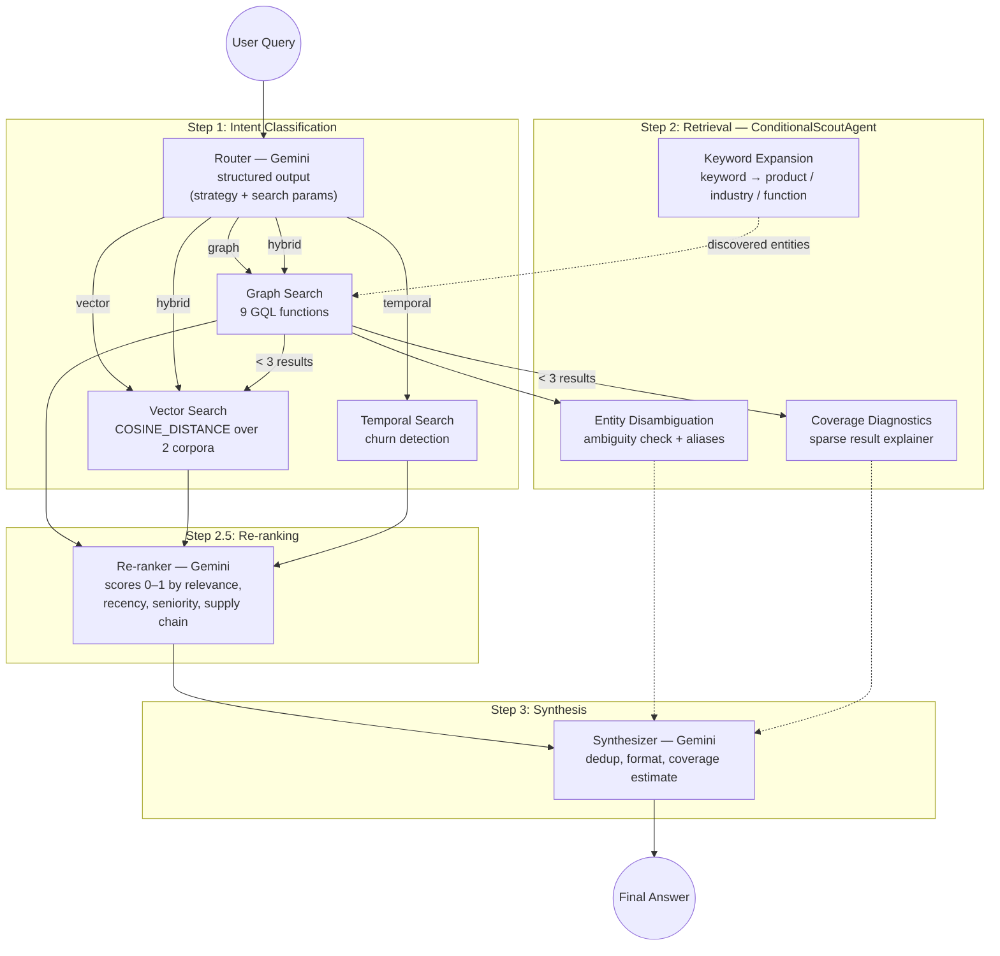
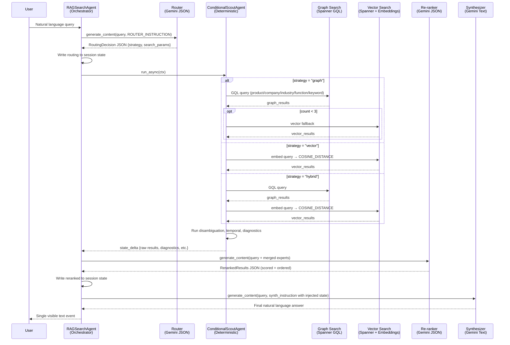
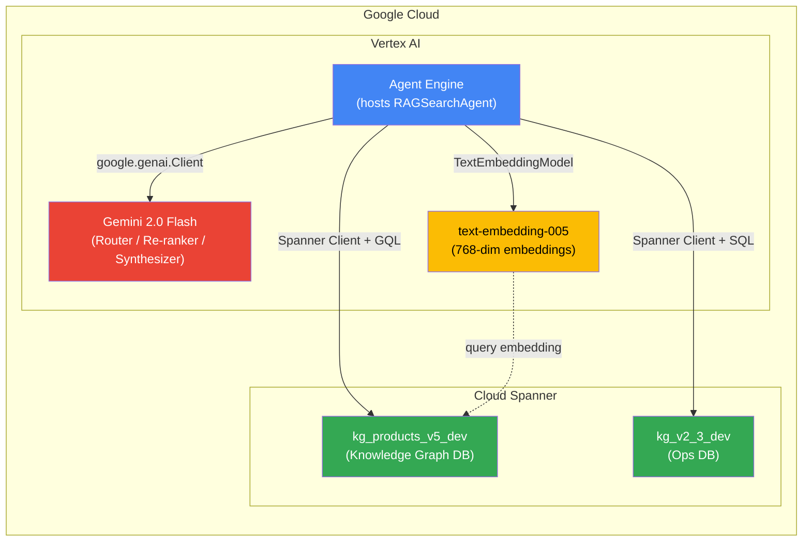
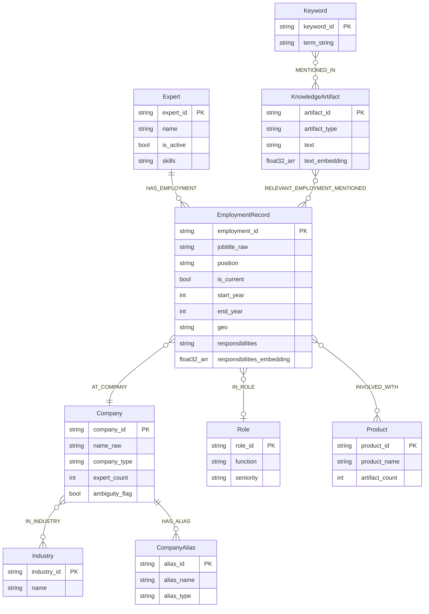
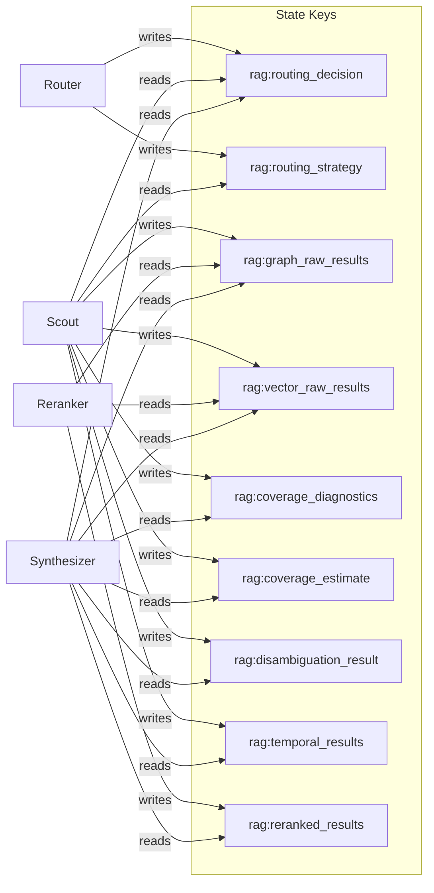

# Vertex RAG Search Agent

An expert discovery pipeline that finds domain experts across professional networks using a hybrid retrieval strategy combining **Spanner Property Graph (GQL)** for structural queries and **Vertex AI Vector Search** for semantic discovery. Built with Google ADK, deployed to Vertex AI Agent Engine.

## Architecture Overview

The agent implements a four-stage pipeline orchestrated by a single `BaseAgent` (`RAGSearchAgent`). All intermediate stages are invisible to the user — only the Synthesizer's final answer is emitted as a visible event. The pipeline uses **session state** as the handoff mechanism between stages, with each stage reading from and writing to well-defined state keys.

Three of the four stages (Router, Re-ranker, Synthesizer) use **Gemini 2.0 Flash** via direct `google.genai.Client` calls. The Scout is fully **deterministic** — it contains no LLM calls and dispatches search tools based on the Router's structured output.



### Request Lifecycle

The following sequence diagram shows the end-to-end flow for a single user query, including session state reads/writes and Gemini calls:



### Deployment Architecture



### Knowledge Graph Schema

The Spanner property graph (`kg_graph`) models expert networks as a set of interconnected node and edge tables. All graph traversals use **GQL** syntax.



### Session State Flow

All pipeline stages communicate through `ctx.session.state` using well-defined keys. This decoupled design means stages can evolve independently.



## Project Structure

```
rag-search-agent/
├── README.md
├── requirements.txt
├── deploy_agent.py                     # Deploys to Vertex AI Agent Engine
├── VertexRAGSearchAgent/
│   ├── agent.py                        # RAGSearchAgent — main orchestrator
│   ├── state.py                        # Session state key constants
│   ├── agents/
│   │   ├── router.py                   # RoutingDecision schema + ROUTER_INSTRUCTION
│   │   ├── scout.py                    # ConditionalScoutAgent — deterministic dispatch
│   │   ├── reranker.py                 # merge_and_dedup + Gemini re-ranking
│   │   └── synthesizer.py              # Instruction builder + final answer formatting
│   └── tools/
│       ├── graph_search.py             # 9 GQL functions + temporal + disambiguation
│       └── vector_search.py            # Vertex embeddings + Spanner COSINE_DISTANCE
└── scripts/
    └── migrations/
        ├── 01_create_instance_and_db.py
        ├── 02_copy_data.py
        ├── 03_apply_property_graph.py
        ├── 04_verify.py
        ├── 05_schema_changes.py
        ├── 05b_schema_fixes.py
        ├── 06_copy_kg_v2_3.py
        ├── 07_generate_embeddings.py   # Populates text_embedding + responsibilities_embedding
        ├── 08_populate_ambiguity_flags.py
        ├── 09_seed_company_aliases.py
        ├── 10_classify_keywords.py
        ├── 11_create_v5_db.py
        ├── 12_load_v5_data.py
        ├── 13_apply_v5_graph.py
        └── 14_prepare_v5_schema.py
```

## Key Components

### 1. Router (`agents/router.py`)

Gemini-powered intent classifier with structured output (`RoutingDecision` schema). Determines the optimal retrieval strategy before any data is fetched.

- **Strategy selection**: `graph`, `vector`, or `hybrid` based on query signals
- **Parameter extraction**: Product, Company, Industry, Function, Seniority, Supply Chain Position
- **Temporal detection**: Recognizes time-based signals ("who left in the last year") and routes to temporal search
- **Auto-upgrade**: Promotes `vector` → `hybrid` when keyword parameters are present

### 2. ConditionalScoutAgent (`agents/scout.py`)

Deterministic `BaseAgent` (no LLM) that reads the routing decision from session state and dispatches search tools:

- **Graph path** → runs graph search → if results < 3 → automatic vector fallback
- **Vector path** → runs vector search only
- **Hybrid path** → runs graph + vector in parallel
- **Temporal path** → runs churn detection (employment, involvement, relationship)
- **Disambiguation** → checks ambiguous company names, surfaces aliases
- **Coverage diagnostics** → explains why results are sparse ("Company found, but no linked experts")

### 3. Re-ranker (`agents/reranker.py`)

Gemini contextual re-ranking step between Scout and Synthesizer. Merges results from all sources, deduplicates by expert, and scores each expert 0–1 on:

- Query relevance
- Recency (current vs. former roles)
- Seniority level
- Supply chain position match

### 4. Synthesizer (`agents/synthesizer.py`)

Final Gemini call that produces the user-facing answer. Reads re-ranked results from session state and generates a structured response with:

- Expert profiles with evidence-based relevance explanations
- Disambiguation notices (when company names are ambiguous)
- Coverage estimate ("Found X of ~Y estimated experts")
- Diagnostic notes (when results are sparse)

## Retrieval Strategies

### Structural Search — Graph (`tools/graph_search.py`)

9 GQL functions over Spanner Property Graph:

| Function | Traversal Path | Use Case |
|----------|---------------|----------|
| `search_experts_by_product` | Expert → Employment → Product | "Who works with SAP ERP?" |
| `search_experts_by_company` | Expert → Employment → Company | "Experts at Shell" |
| `search_experts_by_industry` | Expert → Employment → Company → Industry | "Oil & gas experts" |
| `search_experts_by_function` | Expert → Employment → Role | "VP-level finance people" |
| `search_experts_by_keyword` | Keyword → Artifact → Employment → Expert | "SCADA specialists" |
| `expand_keyword_to_experts` | Keyword → Product/Industry/Function → Expert | Keyword expansion |
| `search_experts_multi_hop` | Combined product + company + industry + function | Complex queries |
| `get_expert_profile` | Full employment history for one expert | Profile lookup |
| `get_coverage_diagnostics` | Entity existence + expert/artifact counts | Sparse result analysis |

Additional tools: `find_recent_churn()` (temporal search), `check_company_disambiguation()` (entity disambiguation).

### Semantic Search — Vector (`tools/vector_search.py`)

Vertex AI `text-embedding-005` (768 dimensions) with `COSINE_DISTANCE` in Spanner. Two embedding corpora searched via UNION ALL:

| Corpus | Source | Use Case |
|--------|--------|----------|
| `knowledge_artifact.text_embedding` | Published articles, papers, analyses | Domain expertise signals |
| `employment_record.responsibilities_embedding` | Job responsibility descriptions | Duty-oriented queries ("managed P&L", "oversaw operations") |

Results are deduplicated by expert in Python (over-fetch `limit × 10`) and tagged with `match_source` for evidence attribution.

## Technical Stack

| Component | Technology |
|-----------|-----------|
| Framework | Google ADK (Agent Development Kit) |
| LLM | Gemini 2.0 Flash |
| Database | Google Cloud Spanner — Property Graph + GQL |
| Embeddings | Vertex AI `text-embedding-005` (768 dims) |
| Validation | Pydantic >= 2.7 |
| Deployment | Vertex AI Agent Engine |

## Configuration

The agent uses environment variables with sensible defaults for development:

| Variable | Purpose | Default |
|----------|---------|---------|
| `GCP_PROJECT_ID` | GCP project | `gcp-poc-488614` |
| `GCP_REGION` | Vertex AI region | `us-central1` |
| `SPANNER_INSTANCE_ID` | Spanner instance | `kg-dev-instance` |
| `SPANNER_DATABASE_ID` | Knowledge graph DB | `kg_products_v5_dev` |
| `SPANNER_OPS_DATABASE_ID` | Operations DB | `kg_v2_3_dev` |

## Deployment

```bash
pip install -r requirements.txt
python deploy_agent.py
```

The deploy script packages `VertexRAGSearchAgent/` as an extra package and uploads it to Agent Engine. On success, it prints the Console URL for interactive chat.

## Status

| Phase | Features | Status |
|-------|----------|--------|
| **Phase 1** | Vector search, sparse result explainer, entity disambiguator, embedding generation | ✅ Complete |
| **Phase 2** | Re-ranker, keyword expansion, temporal tool, coverage estimation | ✅ Complete |
| **Phase 3** | Multi-turn sessions, query decomposition, schema lookup, A2A integration | Planned |
